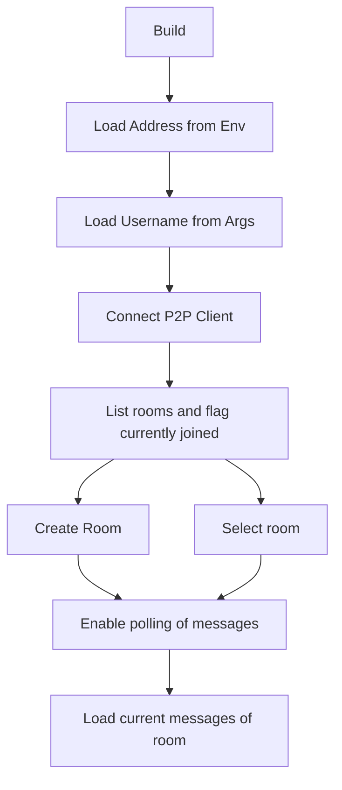
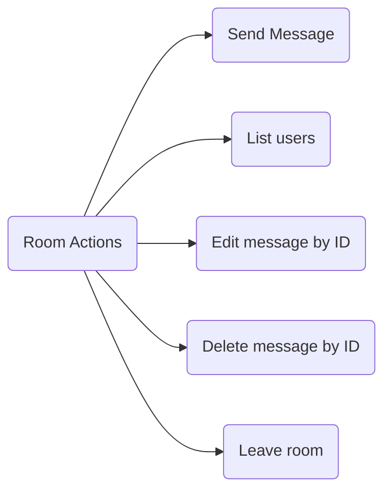
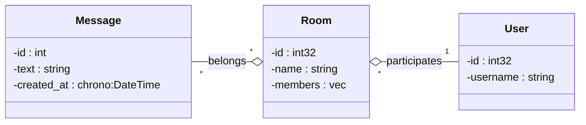

# p2p-cli

A CLI tool to communicate with a P2P network with other nodes with the concept of rooms and membership

## Run Locally

Clone the project

```bash
  git clone git@github.com:thiduzz/p2p-cli.git
```

Go to the project directory

```bash
  cd p2p-cli
```

Run the node

```bash
  cargo run
```

## Flow Diagrams





## Authors

- [@thiduzz](https://www.github.com/thiduzz)


## License

[MIT](https://choosealicense.com/licenses/mit/)